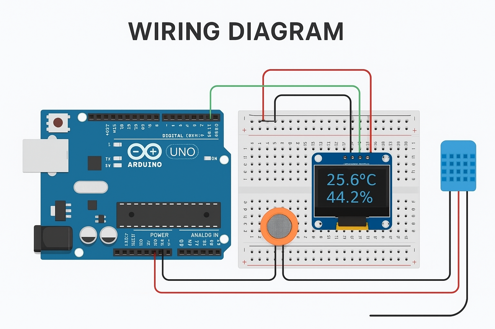

# Arduino MQ-2 Gas + DHT11 Temp/Humidity Sensor

A combined gas detection and climate monitoring project using Arduino UNO, MQ-2 gas sensor, and DHT11 temperature/humidity sensor. Includes buzzer and LED alarm.

## Acknowledgements
- **Gemini**, **ChatGPT**, and **Claude** were used to generate, refine, and improve the OpenSCAD code, making it more modular and parametric.
- The conceptual wiring diagram was also created with the assistance of these AI models.
---

## 📦 Features
- Detects gas/smoke using **MQ-2 sensor**.
- Measures temperature and humidity with **DHT11**.
- Buzzer + LED alerts when gas exceeds threshold.
- Option to display temperature in **Celsius or Fahrenheit**.
- Smoothed gas readings for better accuracy.

---

## 🛠 Hardware Required
- Arduino UNO (or compatible)
- MQ-2 Gas Sensor
- DHT11 Temperature/Humidity Sensor
- Active Buzzer
- LED + Resistor (220Ω)
- Jumper Wires
- Breadboard or PCB

---

## 📐 Circuit Diagram

| Arduino Pin | Component                 |
|-------------|---------------------------|
| A0          | MQ-2 Analog Output        |
| 3           | DHT11 Data Pin             |
| 8           | Buzzer (+)                 |
| 9           | LED (+ via resistor)       |
| GND         | All Components GND         |
| 5V          | MQ-2 + DHT11 VCC           |

---

## 📄 How It Works
1. MQ-2 detects gas concentration.
2. DHT11 reads temperature and humidity.
3. Values are printed to Serial Monitor.
4. If gas exceeds the set threshold, buzzer and LED turn on.

---

## 🔧 Setup Instructions
1. Install the **DHT sensor library** in Arduino IDE:
   - Go to `Sketch > Include Library > Manage Libraries...`
   - Search for **DHT sensor library by Adafruit** and install.
2. Connect components according to the wiring diagram.
3. Upload the code from `mq2_dht11.ino` to your Arduino.
4. Open Serial Monitor (9600 baud) to view live data.

---

## ⚖ License
This project is licensed under the MIT License — you are free to use, modify, and distribute.

---

## 🤝 Contributing
Pull requests are welcome. For major changes, please open an issue first to discuss ideas.

---

## 📢 Author
Created by Garrett Goben – inspired by DIY electronics and IoT safety devices.
